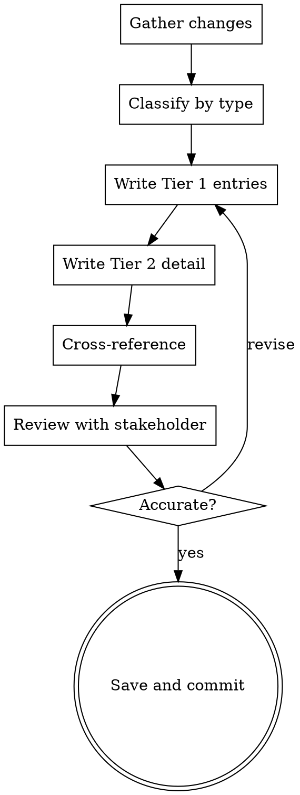

# Writing Changelogs

## Overview

Produce structured changelogs at two levels: a **root changelog** with high-level summaries of what shipped, and **version-specific changelogs** with detailed, low-level documentation of every change. The two-tier approach serves different audiences — stakeholders skim the root, developers dig into the version docs.

**Core principle:** A changelog answers "what changed and why?" for every audience — from executives who need the headline to developers who need the diff context.

**Announce at start:** "I'm using the writing-changelogs skill to document these changes."

## When to Use

- Writing release notes for a new version
- Documenting what changed between releases
- Creating version history for a project
- Summarizing a sprint or milestone's output
- Preparing a changelog entry as part of a design spec or scope breakdown

**Not for:**

- Pre-writing what _will_ ship → use `writing-scope-breakdowns` (changelog entry section)
- Documenting how to use a feature → use `writing-reference-docs`
- Ongoing operational procedures → use `writing-sops`

## Two-Tier Structure

### Tier 1: Root Changelog (`CHANGELOG.md`)

Lives at the project root. High-level, scannable, audience: **everyone**.

```markdown
# Changelog

All notable changes to this project are documented here.
Format follows [Keep a Changelog](https://keepachangelog.com/).

## [Unreleased]

### Added

- Brief description of new capability (one line)

### Changed

- Brief description of behavior change

### Fixed

- Brief description of bug fix

## [1.2.0] - 2026-02-22

### Added

- Tuning Agent for proactive style harmony (#234)
- Issue filtering and sorting in Unified Issues panel (#228)

### Changed

- Agent Registry now auto-discovers agents on startup

### Fixed

- Style scanner no longer misses violations in nested lists (#241)

### Removed

- Legacy style checker (replaced by Tuning Agent)

## [1.1.0] - 2026-01-15

...
```

**Rules for Tier 1:**

- One line per change — no paragraphs
- Lead with _what_, not _how_
- Group by: Added, Changed, Deprecated, Removed, Fixed, Security
- Link to issues/PRs where applicable
- Most recent version first
- Include `[Unreleased]` section for in-progress work

### Tier 2: Version Changelog (`docs/changelogs/v1.2.0.md`)

Lives in a dedicated directory. Detailed, technical, audience: **developers and implementers**.

```markdown
# v1.2.0 — The Tuning Agent

**Release Date:** 2026-02-22
**Codename:** Proactive Style Harmony

## Summary

2-3 sentence overview of what this release delivers and why it matters.

## New Features

### Tuning Agent (#234)

**What:** Proactive style harmony agent that scans documents for
style violations and offers AI-powered fix suggestions.

**Why:** Users previously had to manually review lint output and
craft fixes. The Tuning Agent automates this workflow.

**How it works:**

1. Scanner bridges linting infrastructure with AI fix generation
2. LLM generates context-aware rewrites preserving meaning
3. Accept/Reject UI gives users full control

**Key interfaces:**

- `IStyleDeviationScanner` — deviation detection
- `IFixSuggestionGenerator` — AI fix generation
- `ILearningLoopService` — feedback and learning

**Configuration:**

- Feature gate: `FeatureFlags.TuningAgent`
- License: Writer Pro (core), Teams (Learning Loop)

**Breaking changes:** None

### Issue Filters (#228)

...

## Bug Fixes

### Nested list violations missed (#241)

**Root cause:** Scanner was only checking top-level list items.
**Fix:** Recursive traversal now covers all nesting levels.
**Affected versions:** v1.1.0 - v1.1.3

## Breaking Changes

List any breaking changes with migration guidance.
If none, state "None in this release."

## Deprecations

What's deprecated, what replaces it, removal timeline.

## Dependencies

| Package  | Previous | New   | Reason               |
| -------- | -------- | ----- | -------------------- |
| DiffPlex | —        | 1.7.x | Text diff generation |

## Migration Guide (if breaking changes)

Step-by-step instructions to upgrade from the previous version.

## Known Issues

Issues discovered after release, with workarounds if available.
```

## Process



## Checklist

1. **Gather changes** — review commits, PRs, issues closed since last release
2. **Classify each change** — Added, Changed, Deprecated, Removed, Fixed, Security
3. **Write Tier 1 entries** — one line per change, lead with _what_
4. **Write Tier 2 detail** — what, why, how, key interfaces, configuration, breaking changes
5. **Document dependencies** — new, updated, or removed packages with reasons
6. **Write migration guide** — if breaking changes exist, provide step-by-step upgrade path
7. **Note known issues** — any issues discovered post-release with workarounds
8. **Cross-reference** — Tier 1 entries link to Tier 2 sections; both link to issues/PRs
9. **Review** — verify accuracy with someone who worked on the changes
10. **Save** — commit both `CHANGELOG.md` and `docs/changelogs/vX.Y.Z.md`
11. **Verify claims** — **REQUIRED SUB-SKILL:** Use superpowers:writing-doc-reviews to verify interface names, config references, and behavioral claims

## Category Definitions

| Category       | What Goes Here                             | Example                                           |
| -------------- | ------------------------------------------ | ------------------------------------------------- |
| **Added**      | New features, capabilities, endpoints      | "Tuning Agent for proactive style harmony"        |
| **Changed**    | Behavior changes to existing features      | "Agent Registry now auto-discovers on startup"    |
| **Deprecated** | Features marked for future removal         | "Legacy style checker (use Tuning Agent instead)" |
| **Removed**    | Features removed in this release           | "Removed v1 API endpoints"                        |
| **Fixed**      | Bug fixes                                  | "Scanner no longer misses nested list violations" |
| **Security**   | Vulnerability fixes, security improvements | "Updated TLS to 1.3, patched CVE-2026-1234"       |

## Tier 1 vs Tier 2 Depth Guide

| Aspect               | Tier 1 (Root) | Tier 2 (Version)                |
| -------------------- | ------------- | ------------------------------- |
| **Audience**         | Everyone      | Developers                      |
| **Length per item**  | 1 line        | 1-2 paragraphs + code/config    |
| **Detail**           | What changed  | What, why, how, migration       |
| **Breaking changes** | Mentioned     | Full migration guide            |
| **Dependencies**     | Not listed    | Table with versions and reasons |
| **Known issues**     | Not listed    | Listed with workarounds         |
| **Interfaces/APIs**  | Not listed    | Key interfaces named            |

## Common Mistakes

| Mistake                               | Fix                                                                       |
| ------------------------------------- | ------------------------------------------------------------------------- |
| Changelog reads like a commit log     | Summarize for humans, not machines. Group related commits into one entry. |
| Only Tier 1 exists                    | Developers need Tier 2 detail — what, why, how, migration.                |
| Missing "why" in Tier 2               | Every change should explain the rationale, not just the diff.             |
| Breaking changes buried in the middle | Call them out prominently with migration guidance.                        |
| No issue/PR links                     | Cross-reference everything for traceability.                              |
| Tier 1 entries are too detailed       | One line max. Save detail for Tier 2.                                     |
| Tier 2 entries lack code/config       | Show key interfaces, configuration, and usage examples.                   |
| "Various bug fixes"                   | Name every fix. Vague entries erode trust.                                |
| No `[Unreleased]` section             | Always maintain it — it's the staging area for the next release.          |
| Inconsistent category usage           | Use the category definitions table. "Changed" ≠ "Fixed".                  |

## Key Principles

- **Two tiers, two audiences** — root is for scanning, version docs are for understanding
- **What and why, not just how** — every entry explains the rationale
- **One line in Tier 1** — if it takes two lines, it's too detailed for the root
- **Every fix gets named** — "various bug fixes" is not acceptable
- **Cross-reference everything** — link Tier 1 → Tier 2 → issues/PRs
- **Breaking changes are prominent** — never bury them; include migration steps
- **[Unreleased] is always current** — it's the living staging area for the next version
- **Keep a Changelog format** — follow the convention unless the project has an established alternative
