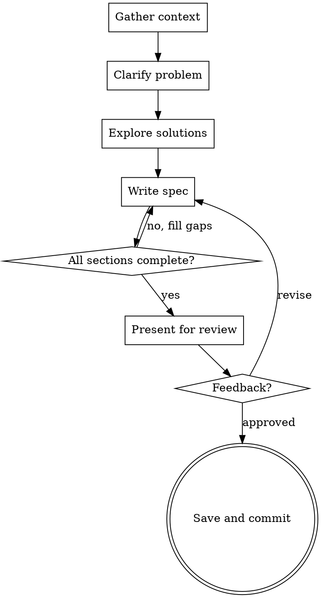

# Writing Design Specifications

## Overview

Produce a structured design specification that can be reviewed asynchronously, shared with stakeholders, or archived. The output is a standalone document—not a conversation, not a code plan.

**Core principle:** A design spec answers "what are we building and why?" with enough rigor that someone reading it cold can evaluate the decision.

**Announce at start:** "I'm using the writing-design-specs skill to create this specification."

## When to Use

- Writing an RFC, ADR, or technical design document
- Documenting architecture decisions before implementation
- Creating a spec that needs stakeholder review
- Recording the rationale behind a technical choice

**Not for:**

- Implementation task lists → use `writing-plans`
- Conversational design exploration → use `brainstorming`
- User-facing documentation → use `writing-reference-docs`

## Document Structure

Every design spec MUST include the **core sections**. Include **extended sections** when the feature involves APIs, services, or multi-component work. Scale each section's length to its complexity.

```markdown
# [Title]: Design Specification

## Document Control

| Field               | Value                                            |
| :------------------ | :----------------------------------------------- |
| **Document ID**     | [project-prefix]-DES-[feature-id]                |
| **Feature Name**    | [name]                                           |
| **Module Scope**    | [where this lives in the codebase]               |
| **Status**          | Draft \| In Review \| Approved \| Superseded     |
| **Author**          | [name]                                           |
| **Date**            | YYYY-MM-DD                                       |
| **Reviewers**       | [names/roles]                                    |
| **Est. Hours**      | [estimate]                                       |
| **Parent Document** | [link to scope breakdown or parent spec, if any] |

## Problem Statement

What problem are we solving? Why now? What's the cost of not solving it?

## Proposed Solution

How we'll solve it. Architecture, components, data flow, interfaces.
Diagrams where they add clarity (not for decoration).

## Architecture (for multi-component work)

Component diagram (Mermaid or DOT). Module/file location map.
Show where new code lives relative to existing structure.

## Data Contract / API (when building interfaces)

Full interface definitions with parameter docs.
Records, enums, configuration types.
Include usage examples in the contract.

## Constraints

Technical limitations, time, budget, team capacity, backwards compatibility,
regulatory requirements—anything that bounds the solution space.

## Alternatives Considered

At least 2 alternatives with trade-off analysis.
Why they were rejected. Be honest about trade-offs in the chosen approach too.

## Error Handling

Error cases table: case, handling strategy, example.
Don't just say "throw exception"—define what the caller sees.

## Performance Considerations (when relevant)

Targets with specific numbers (e.g., "<50ms P95 for 1000 items").
Optimization strategies. What to measure.

## Success Criteria

Measurable outcomes. How will we know this worked?

## Acceptance Criteria

| #   | Category | Criterion | Verification |
| --- | -------- | --------- | ------------ |

Numbered, testable, with verification method (unit test, integration test, manual).

## Open Questions

Unresolved decisions, risks, areas needing more research.
Each question should note who can answer it and when it needs resolution.

## Dependencies

What this depends on. What depends on this.
Include library/package versions, external services, upstream/downstream systems.
Track as a living checklist—mark resolved vs. unresolved.

## Development Standards

Establish expectations for implementation BEFORE work begins:

**Changelog requirements:**

- What level of detail entries need (one-liner vs. full description with rationale)
- Format convention (Keep a Changelog, Conventional Commits, custom)
- Audience for the changelog (developers, end users, both)

**Logging standards:**
Define log levels and what goes at each:
| Level | Use For | Example |
|-------|---------|----------|
| DEBUG | Internal state for troubleshooting | Variable values, branch decisions |
| INFO | Significant events in normal operation | Startup, config loaded, request served |
| WARN | Recoverable problems | Retry succeeded, fallback used, deprecated usage |
| ERROR | Failures requiring attention | Unhandled exception, data loss risk |

No sensitive data in logs. No log-and-throw (pick one).
Include structured log templates where applicable.

**Unit testing expectations:**

- What must be tested (business logic, edge cases, error paths)
- What can be skipped (trivial getters, framework boilerplate)
- Coverage targets if applicable
- Test naming conventions
- Include representative test cases in the spec when useful

**Dependency tracking:**

- Pin versions or define acceptable ranges
- Document why each dependency was chosen
- Track transitive dependencies with known risks
- Define update/audit cadence

## Deliverable Checklist

| #   | Deliverable | Status |
| --- | ----------- | ------ |

Trackable list of concrete outputs with status column.

## Document History

| Version | Date | Author | Changes |
| ------- | ---- | ------ | ------- |
```

## Process



## Scaling Guide

| Spec Complexity                               | Sections to Include                                                                                 |
| --------------------------------------------- | --------------------------------------------------------------------------------------------------- |
| **Small** (config change, minor feature)      | Document Control, Problem Statement, Proposed Solution, Constraints, Success Criteria, Dependencies |
| **Medium** (new component, API addition)      | All core + Architecture, Data Contract/API, Acceptance Criteria, Development Standards              |
| **Large** (new service, cross-cutting change) | All sections including Error Handling, Performance, Unit Testing examples, Deliverable Checklist    |

Don't over-document a config change. Don't under-document a new service.

## Checklist

1. **Gather context** — review codebase, docs, related decisions
2. **Clarify the problem** — ask questions to understand scope, constraints, stakeholders
3. **Explore at least 2 solutions** — with honest trade-off analysis
4. **Write the spec** — include all sections appropriate for the complexity level
5. **Define development standards** — changelog, logging, testing, dependencies
6. **Add acceptance criteria** — numbered, testable, with verification method
7. **Present section by section** — get approval incrementally
8. **Save** — commit to `docs/specs/YYYY-MM-DD-<topic>.md`

## Common Mistakes

| Mistake                                          | Fix                                                                                                                   |
| ------------------------------------------------ | --------------------------------------------------------------------------------------------------------------------- |
| Jumping to solution without stating problem      | Write Problem Statement first, get agreement                                                                          |
| Only one alternative ("we should do X")          | Always include 2+ alternatives with trade-offs                                                                        |
| Success criteria are vague ("it should be fast") | Use measurable targets ("p95 latency < 200ms")                                                                        |
| Open questions left unassigned                   | Every question needs an owner and deadline                                                                            |
| Spec becomes implementation plan                 | Stop at _what_ and _why_—leave _how_ to `writing-plans`                                                               |
| Inventing features not in the problem statement  | The spec describes the agreed-upon solution. Adding unsolicited functionality is scope creep disguised as initiative. |
| Skipping Development Standards section           | Standards set upfront prevent inconsistency during implementation. Don't leave them to assumption.                    |
| No error handling section                        | Define what happens when things fail. "It throws an exception" is not a strategy.                                     |
| Logging without structure                        | Define log levels, templates, and what goes where. See Development Standards.                                         |
| No deliverable checklist                         | A trackable list of outputs keeps everyone aligned on what "done" means.                                              |
| Missing document history                         | Without a change log, reviewers can't tell what changed between revisions.                                            |

## Key Principles

- **Problem before solution** — don't skip to the answer
- **Honest trade-offs** — every approach has downsides; state them
- **Measurable success** — if you can't measure it, you can't evaluate it
- **Living document** — update status and document history as decisions progress
- **Appropriate depth** — a config change needs 1 page, a new service needs 5 (see Scaling Guide)
- **Only what was asked for** — the spec solves the stated problem, nothing more. Unsolicited features are scope creep.
- **Standards before implementation** — define changelog, logging, testing, and dependency expectations upfront so implementers don't have to guess
