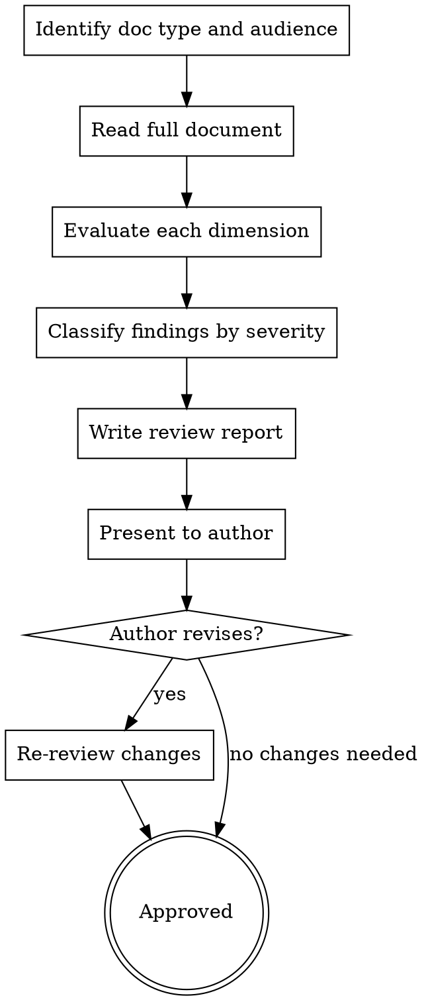

# Writing Documentation Reviews

## Overview

Systematically review documentation for accuracy, completeness, clarity, and audience fit. Produces structured feedback with severity levels and actionable suggestions—the documentation counterpart to code review.

**Core principle:** Documentation review is not proofreading. It evaluates whether the document achieves its purpose for its intended audience.

**Announce at start:** "I'm using the writing-doc-reviews skill to review this documentation."

## When to Use

- Reviewing a draft before publishing
- Auditing existing documentation for quality
- Editing docs for a new audience or context
- Evaluating documentation completeness against a spec or feature set

**Not for:**

- Writing new documentation → use `writing-reference-docs`, `writing-sops`, or `writing-design-specs`
- Code review → use `requesting-code-review`

## Review Dimensions

Evaluate every document against these 7 dimensions:

| Dimension                | What to Check                                                                                                                                                                  |
| ------------------------ | ------------------------------------------------------------------------------------------------------------------------------------------------------------------------------ |
| **Accuracy**             | Are facts, commands, outputs, and examples correct? Do code samples run?                                                                                                       |
| **Completeness**         | Are all features/steps covered? Missing sections? Gaps in edge cases?                                                                                                          |
| **Clarity**              | Can the target audience understand it? Jargon defined? Ambiguity removed?                                                                                                      |
| **Structure**            | Logical flow? Scannable? Appropriate headings, tables, lists?                                                                                                                  |
| **Consistency**          | Same terms throughout? Matches UI/CLI labels? Follows style conventions?                                                                                                       |
| **Audience Fit**         | Right level of detail for the reader? Prerequisites stated?                                                                                                                    |
| **Standards Compliance** | Does it follow established dev standards? Changelog depth, logging levels (DEBUG/INFO/WARN/ERROR), unit testing expectations, dependency tracking, acceptance criteria format? |

## Process



## Review Report Format

```markdown
# Documentation Review: [Document Title]

**Reviewer:** [name]
**Date:** YYYY-MM-DD
**Document Type:** [guide / reference / SOP / spec / etc.]
**Target Audience:** [who this is for]

## Summary

2-3 sentence overall assessment.

## Findings

### Critical (blocks publishing)

- **[Section]:** Issue description → Suggested fix

### Important (should fix before publishing)

- **[Section]:** Issue description → Suggested fix

### Minor (improve when convenient)

- **[Section]:** Issue description → Suggested fix

## Dimension Scores

| Dimension            | Score (1-5) | Notes |
| -------------------- | ----------- | ----- |
| Accuracy             |             |       |
| Completeness         |             |       |
| Clarity              |             |       |
| Structure            |             |       |
| Consistency          |             |       |
| Audience Fit         |             |       |
| Standards Compliance |             |       |

## Strengths

What the document does well. Be specific.
```

## Severity Definitions

| Severity      | Definition                                                                    | Action                       |
| ------------- | ----------------------------------------------------------------------------- | ---------------------------- |
| **Critical**  | Incorrect information, missing safety steps, commands that could cause damage | Must fix before publishing   |
| **Important** | Missing sections, unclear instructions, inconsistent terminology              | Should fix before publishing |
| **Minor**     | Style issues, optimization suggestions, nice-to-haves                         | Fix when convenient          |

## Checklist

1. **Identify context** — what type of doc, who's the audience, what's its purpose
2. **Full read-through** — read the entire document before noting issues
3. **Systematic evaluation** — check each of the 7 dimensions
4. **Verify claims** — test commands, check links, validate examples
5. **Check standards compliance** — does the doc define or follow established conventions for changelogs, logging, testing, dependencies?
6. **Classify severity** — Critical / Important / Minor
7. **Write actionable feedback** — every finding needs a suggested fix, not just a complaint
8. **Note strengths** — what works well should be called out too
9. **Present review** — discuss with author, iterate if needed

## Common Mistakes

| Mistake                          | Fix                                                                                             |
| -------------------------------- | ----------------------------------------------------------------------------------------------- |
| Only checking grammar/spelling   | Review covers 6 dimensions, not just proofreading                                               |
| Findings without suggested fixes | Every issue needs an actionable recommendation                                                  |
| Not testing code examples        | Run every command and code block                                                                |
| Missing audience consideration   | State who this doc is for, then review through their eyes                                       |
| Nitpicking style over substance  | Prioritize accuracy and completeness over formatting                                            |
| Skipping the strengths section   | Balanced feedback is better feedback                                                            |
| Ignoring standards compliance    | Check for defined logging levels, changelog conventions, test expectations, dependency tracking |

## Key Principles

- **Purpose over polish** — does it achieve its goal?
- **Actionable feedback** — every finding gets a fix, not just a complaint
- **Audience empathy** — review as the reader, not the expert
- **Verify, don't assume** — test every claim, command, and example
- **Severity matters** — not all issues are equal; classify them
