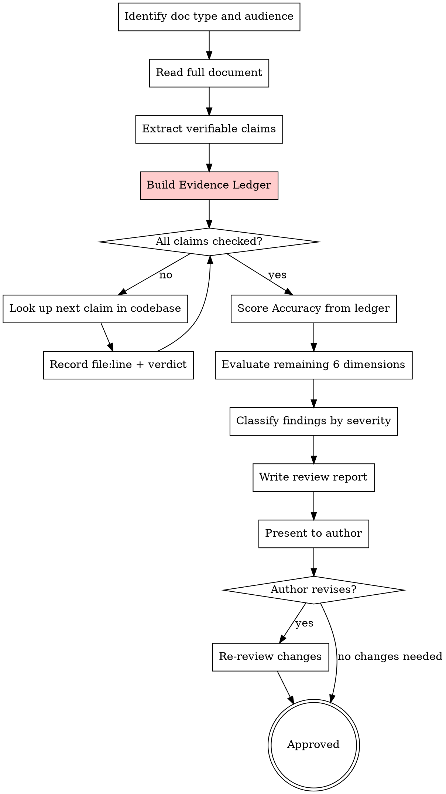

# Writing Documentation Reviews

## Overview

Systematically review documentation with mandatory codebase evidence verification. Every verifiable claim must be checked against actual code before a review is complete.

**Core principle:** Documentation that claims something about code without evidence is fiction, not documentation.

**Violating the letter of this rule is violating the spirit of this rule.**

**Announce at start:** "I'm using the writing-doc-reviews skill to review this documentation with codebase evidence verification."

## The Iron Law

```
NO ACCURACY SCORE WITHOUT A COMPLETED EVIDENCE LEDGER
```

If you haven't looked up the code, you cannot claim the documentation is accurate.

**No exceptions:**
- Don't score Accuracy based on "it looks right"
- Don't skip verification because "I wrote the doc myself"
- Don't claim VERIFIED without citing file:line
- Don't mark NOT FOUND without searching

## When to Use

- Reviewing a draft before publishing
- Auditing existing documentation for quality
- Editing docs for a new audience or context
- Evaluating documentation completeness against a spec or feature set

**Mandatory after:**
- Any `writing-reference-docs` output
- Any `writing-changelogs` output
- Any `writing-sops` output
- Any `writing-design-specs` output that references existing code
- Any `writing-scope-breakdowns` output that references existing interfaces

**Not for:**
- Writing new documentation → use `writing-reference-docs`, `writing-sops`, or `writing-design-specs`
- Code review → use `requesting-code-review`

## Review Dimensions

Evaluate every document against these 7 dimensions:

| Dimension                | What to Check                                                                                                                                                                  |
| ------------------------ | ------------------------------------------------------------------------------------------------------------------------------------------------------------------------------ |
| **Accuracy (Verified)**  | Every verifiable claim checked against codebase. Evidence Ledger complete. No CONTRADICTED claims remain unfixed.                                                              |
| **Completeness**         | Are all features/steps covered? Missing sections? Gaps in edge cases?                                                                                                          |
| **Clarity**              | Can the target audience understand it? Jargon defined? Ambiguity removed?                                                                                                      |
| **Structure**            | Logical flow? Scannable? Appropriate headings, tables, lists?                                                                                                                  |
| **Consistency**          | Same terms throughout? Matches UI/CLI labels? Follows style conventions?                                                                                                       |
| **Audience Fit**         | Right level of detail for the reader? Prerequisites stated?                                                                                                                    |
| **Standards Compliance** | Does it follow established dev standards? Changelog depth, logging levels (DEBUG/INFO/WARN/ERROR), unit testing expectations, dependency tracking, acceptance criteria format? |

## Process



## Verifiable Claim Types

| Type                  | Example in Doc                                | How to Verify                   |
| --------------------- | --------------------------------------------- | ------------------------------- |
| Function/method name  | "`retryOperation()` handles retries"          | Grep for function definition    |
| Function signature    | "takes `(fn, maxRetries, delay)`"             | Read function declaration       |
| API endpoint          | "`POST /api/users`"                           | Grep for route definition       |
| CLI command/flag      | "`--verbose` enables debug output"            | Grep for flag parsing           |
| Config option         | "`timeout` defaults to 30s"                   | Read config/defaults file       |
| File path             | "Edit `src/config/settings.ts`"               | Glob for file existence         |
| Code snippet          | `` ```typescript const x = ...``` ``          | Read source, compare            |
| Behavioral claim      | "Retries 3 times on failure"                  | Read implementation logic       |
| Feature existence     | "Supports batch processing"                   | Grep for feature code           |

## Evidence Ledger Format

Every review MUST include this table:

```markdown
## Evidence Ledger

| # | Claim | Type | Source (file:line) | Verdict |
|---|-------|------|--------------------|---------|
| 1 | claim text | type | file:line | VERDICT |

**Summary:** X total claims | Y VERIFIED | Z CONTRADICTED | W NOT FOUND | V UNVERIFIABLE
```

**Verdicts:**
- **VERIFIED** — Code matches claim. Cite file:line.
- **CONTRADICTED** — Code conflicts with claim. Cite file:line + actual value. **Auto-Critical.**
- **NOT FOUND** — Expected code not found after searching. **Auto-Important.**
- **UNVERIFIABLE** — No code to check (process claim, future feature). Note why.

## Verification Method

```
Fewer than 10 verifiable claims → verify inline using Grep/Read
10+ verifiable claims → dispatch verification subagent with extracted claim list
```

For each claim:
1. Identify search strategy (Grep pattern, file path, Glob)
2. Execute search
3. Read relevant code at the match location
4. Compare claim to actual code
5. Record verdict with evidence

## Review Report Format

```markdown
# Documentation Review: [Document Title]

**Reviewer:** [name]
**Date:** YYYY-MM-DD
**Document Type:** [guide / reference / SOP / spec / etc.]
**Target Audience:** [who this is for]

## Summary

2-3 sentence overall assessment.

## Evidence Ledger

| # | Claim | Type | Source (file:line) | Verdict |
|---|-------|------|--------------------|---------|

**Summary:** X total | Y VERIFIED | Z CONTRADICTED | W NOT FOUND | V UNVERIFIABLE

## Findings

### Critical (blocks publishing)

- **[Section]:** Issue description → Suggested fix

### Important (should fix before publishing)

- **[Section]:** Issue description → Suggested fix

### Minor (improve when convenient)

- **[Section]:** Issue description → Suggested fix

## Dimension Scores

| Dimension              | Score (1-5) | Notes                                          |
| ---------------------- | ----------- | ---------------------------------------------- |
| Accuracy (Verified)    |             | [X/Y claims verified. Z contradictions.]       |
| Completeness           |             |                                                |
| Clarity                |             |                                                |
| Structure              |             |                                                |
| Consistency            |             |                                                |
| Audience Fit           |             |                                                |
| Standards Compliance   |             |                                                |

## Strengths

What the document does well. Be specific.
```

## Severity Definitions

| Severity      | Definition                                                                    | Action                       |
| ------------- | ----------------------------------------------------------------------------- | ---------------------------- |
| **Critical**  | Incorrect information, CONTRADICTED claims, missing safety steps, commands that could cause damage | Must fix before publishing   |
| **Important** | NOT FOUND claims, missing sections, unclear instructions, inconsistent terminology | Should fix before publishing |
| **Minor**     | Style issues, optimization suggestions, nice-to-haves                         | Fix when convenient          |

## Checklist

1. **Identify context** — what type of doc, who's the audience, what's its purpose
2. **Full read-through** — read the entire document before noting issues
3. **Extract verifiable claims** — list every claim that can be checked against code
4. **Build Evidence Ledger** — for EACH claim, look up code, record file:line + verdict
5. **Score Accuracy from ledger** — CONTRADICTED = Critical, NOT FOUND = Important
6. **Evaluate remaining 6 dimensions** — Completeness, Clarity, Structure, Consistency, Audience Fit, Standards Compliance
7. **Check standards compliance** — does the doc define or follow established conventions for changelogs, logging, testing, dependencies?
8. **Classify all findings by severity** — Critical / Important / Minor
9. **Write actionable feedback** — every finding needs a suggested fix, not just a complaint
10. **Note strengths** — what works well should be called out too
11. **Present review** — discuss with author, iterate if needed

## Rationalization Prevention

| Excuse | Reality |
|--------|---------|
| "I wrote this doc, I know it's right" | Memory is not evidence. Look up the code. |
| "The code hasn't changed recently" | You don't know that without checking. |
| "It's just a minor detail" | Minor inaccuracies erode all trust. |
| "I'll verify the important parts" | ALL verifiable claims. No cherry-picking. |
| "This would take too long" | Wrong docs waste more time than verification. |
| "The doc is mostly prose, not technical" | Extract what IS technical. Verify that. |
| "I can tell it's correct from context" | Context is not evidence. Cite file:line. |
| "Previous version was verified" | Code changes. Re-verify against current code. |

## Red Flags - STOP

- Accuracy scored without an Evidence Ledger
- Evidence Ledger has no file:line citations
- "Looks correct" or "seems right" without lookup
- Skipping verification for "simple" claims
- Marking VERIFIED without reading the actual code
- Scoring Accuracy 4-5 with any CONTRADICTED claims
- Ignoring NOT FOUND claims
- "I'll check later" (verify NOW or don't score)

**All of these mean: Complete the Evidence Ledger before proceeding.**

## Forbidden Responses

These responses are NEVER acceptable in a review:

- "The documentation appears accurate" (without evidence)
- "Commands look correct" (without running/checking them)
- "Function signatures match" (without citing source lines)
- "Configuration options are documented correctly" (without reading config files)
- Any positive accuracy claim without a completed Evidence Ledger

## Common Mistakes

| Mistake                                    | Fix                                                                          |
| ------------------------------------------ | ---------------------------------------------------------------------------- |
| Scoring Accuracy without Evidence Ledger   | Complete the ledger FIRST, then score                                        |
| Only checking grammar/spelling             | Review covers 7 dimensions, not just proofreading                            |
| Findings without suggested fixes           | Every issue needs an actionable recommendation                               |
| Checking only function names, not signatures | Verify parameters, return types, defaults too                              |
| Trusting code snippets without comparing   | Read actual source file, diff against doc snippet                            |
| Skipping behavioral claims as "unverifiable" | Read implementation logic; most behavior IS verifiable                     |
| Only checking the first Grep match         | Verify the CORRECT definition (not a test or comment)                        |
| Marking claims UNVERIFIABLE to avoid work  | Only truly non-code claims (process, future plans) are UNVERIFIABLE          |
| Not re-verifying after doc revisions       | Any edit invalidates the ledger for changed claims                           |
| Nitpicking style over substance            | Prioritize accuracy and completeness over formatting                         |
| Skipping the strengths section             | Balanced feedback is better feedback                                         |
| Ignoring standards compliance              | Check for defined logging levels, changelog conventions, test expectations   |

## Key Principles

- **Evidence before judgment** — no Accuracy score without evidence
- **File:line or it didn't happen** — every VERIFIED verdict needs a citation
- **CONTRADICTED is always Critical** — wrong documentation is worse than no documentation
- **Verify, don't assume** — memory, context, and "looks right" are not evidence
- **Complete ledger** — every verifiable claim, not just the ones you're suspicious about
- **Purpose over polish** — does it achieve its goal?
- **Actionable feedback** — every finding gets a fix, not just a complaint
- **Audience empathy** — review as the reader, not the expert
- **Severity matters** — not all issues are equal; classify them
