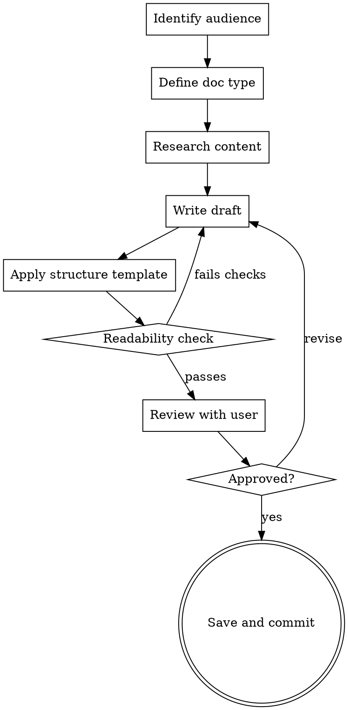

# Writing Reference Documentation

## Overview

Create user-facing reference documentation that people actually use. Covers quick-start guides, API references, help articles, configuration guides, glossaries, FAQs, and reference portals.

**Core principle:** Good reference docs are scannable, progressively disclosed, and written for the reader's context—not the author's knowledge.

**Announce at start:** "I'm using the writing-reference-docs skill to create this documentation."

## When to Use

- Writing quick-start or getting-started guides
- Creating API reference documentation
- Building help portal content or knowledge base articles
- Writing configuration or administration guides
- Creating glossaries, FAQs, or troubleshooting guides

**Not for:**

- Internal design rationale → use `writing-design-specs`
- Operational procedures for a team → use `writing-sops`
- Implementation task lists → use `writing-plans`

## Process



## Checklist

1. **Identify audience** — who reads this? What do they already know?
2. **Pick the doc type** — quick-start, reference, guide, FAQ, glossary (see templates below)
3. **Research** — read the code, test the tool, verify accuracy firsthand
4. **Write** — follow the template for your doc type
5. **Check readability** — run through the readability checklist
6. **Review** — present to user, iterate
7. **Save** — commit to appropriate docs location
8. **Verify** — **REQUIRED SUB-SKILL:** Use superpowers:writing-doc-reviews to verify all codebase claims with evidence

## Doc Type Templates

### Quick-Start Guide

```markdown
# Getting Started with [Tool/Feature]

## Prerequisites

What you need before starting. Versions, installs, access.

## Installation / Setup

Numbered steps. Copy-pasteable commands.

## Your First [Action]

The shortest path to a working result. One focused example.

## Next Steps

Links to deeper guides. Common next actions.
```

### API Reference

```markdown
# [Endpoint / Function / Class]

## Description

One sentence. What it does.

## Syntax / Signature

Code block with parameters.

## Parameters

| Name | Type | Required | Description |
| ---- | ---- | -------- | ----------- |

## Returns

What comes back. Type, structure, edge cases.

## Examples

One common usage. One edge case.

## Errors

What can go wrong. Error codes/messages and fixes.
```

### Configuration Guide

```markdown
# Configuring [Feature]

## Overview

What this configuration controls.

## Options

| Option | Type | Default | Description |
| ------ | ---- | ------- | ----------- |

## Examples

Minimal config. Full config. Common scenarios.

## Troubleshooting

Symptoms, causes, fixes for common misconfigurations.
```

### Glossary

```markdown
# Glossary

**Term** — Definition. Context where this term is used.
Include aliases: "Also called: [alternative terms]"
```

## Readability Checklist

- [ ] **Scannable** — Can the reader find what they need in 10 seconds? (headings, tables, bold key terms)
- [ ] **Progressive disclosure** — Simple case first, details later
- [ ] **Copy-pasteable** — Code examples run as-is, commands work verbatim
- [ ] **No assumed knowledge** — Prerequisites stated, jargon defined or linked
- [ ] **Task-oriented** — Organized by what the reader wants to DO, not by internal structure
- [ ] **Accurate** — Every command tested, every output verified
- [ ] **Consistent** — Same terms used throughout; matches UI/CLI labels exactly

## Common Mistakes

| Mistake                                            | Fix                                                        |
| -------------------------------------------------- | ---------------------------------------------------------- |
| Organized by code structure, not user tasks        | Restructure around user goals ("How to X")                 |
| Placeholder examples (`foo`, `bar`, `example.com`) | Use realistic examples from the actual domain              |
| Untested code examples                             | Run every example. Copy output verbatim.                   |
| Wall of text, no structure                         | Add headings every 3-5 paragraphs. Use tables for options. |
| Writing for experts when audience is beginners     | State prerequisites. Define terms. Link deeper content.    |
| Missing error documentation                        | Document what happens when things go wrong                 |

## Key Principles

- **Audience first** — write for the reader, not the codebase
- **Show, don't tell** — examples over explanations
- **Verify everything** — if you didn't run it, it's probably wrong
- **Scan before read** — most readers scan; structure for that
- **Keep it current** — outdated docs are worse than no docs
