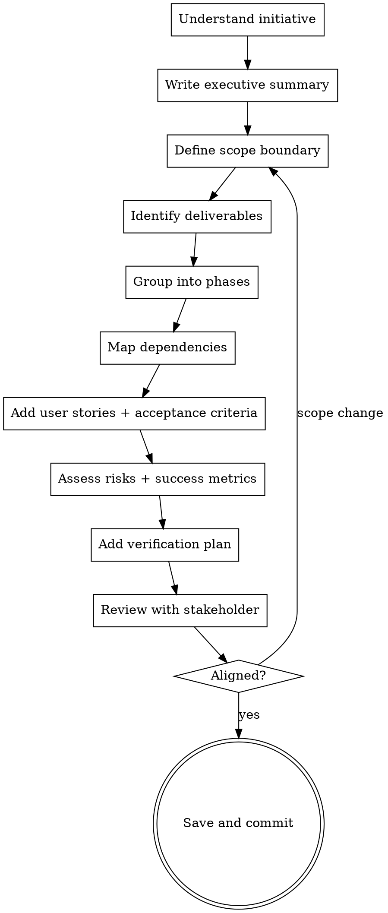

# Writing Scope Breakdowns

## Overview

Decompose a large initiative into well-defined scopes, milestones, and deliverables. The output is a scoping document that defines _what_ gets built and in _what order_—not _how_ to build each piece.

**Core principle:** Good scoping turns an unbounded problem into a sequence of bounded deliverables with clear acceptance criteria.

**Announce at start:** "I'm using the writing-scope-breakdowns skill to break this down."

## When to Use

- Breaking an epic or initiative into phases
- Creating a feature roadmap with dependencies
- Scoping a project for estimation or stakeholder alignment
- Defining milestones and acceptance criteria for a multi-week effort

**Not for:**

- Bite-sized implementation tasks → use `writing-plans`
- Architecture decisions → use `writing-design-specs`
- Ongoing process documentation → use `writing-sops`

## Document Structure

Every scope breakdown MUST include the **core sections**. Include **extended sections** for complex, multi-phase initiatives. Scale to the project's complexity.

```markdown
# [Initiative Name]: Scope Breakdown

## Document Control

| Field           | Value                                       |
| :-------------- | :------------------------------------------ |
| **Document ID** | [project-prefix]-SBD-[version]              |
| **Version**     | [version number]                            |
| **Status**      | Draft \| Aligned \| In Progress \| Complete |
| **Date**        | YYYY-MM-DD                                  |
| **Owner**       | [name]                                      |
| **Depends On**  | [prior versions/initiatives this builds on] |

## Executive Summary

### Vision

What this initiative delivers in 2-3 sentences. Why it matters.

### Business Value

- Bullet list of concrete benefits (time savings, risk reduction, capability gained)

### Success Criteria

Numbered list of measurable outcomes that define success.

## Scope Boundary

What's IN scope. What's explicitly OUT of scope.
Out-of-scope items prevent scope creep—be specific.

## Phases / Sub-Parts

### Phase 1: [Name] — [Target Date]

| Field           | Value                 |
| :-------------- | :-------------------- |
| **Sub-Part ID** | [project-prefix]-[id] |
| **Module**      | [where this lives]    |

**Goal:** What this phase delivers in one sentence.

**User Stories:**

- As a [role], I want [capability], so that [benefit].
- As a [role], I want [capability], so that [benefit].

**Key Deliverables:**

- [ ] Deliverable 1
  - **Acceptance criteria:** Given [context], when [action], then [outcome]
- [ ] Deliverable 2
  - **Acceptance criteria:** ...

**Key Interfaces** (for technical initiatives):
Include interface definitions, records, or contracts when defining
what will be built. These set expectations for implementation.

**Dependencies:** What must exist before this phase starts.
**Risks:** What could delay or derail this phase.

### Phase 2: [Name] — [Target Date]

...

## Implementation Checklist (for estimation)

| #   | Phase | Task | Est. Hours |
| --- | ----- | ---- | ---------- |

Detailed task list across all phases with time estimates.
Groups tasks by sub-part for clarity.

## Dependency Matrix

### Required Interfaces (from prior work)

| Interface | Source | Purpose |
| --------- | ------ | ------- |

### New Interfaces (defined in this initiative)

| Interface | Defined In | Purpose |
| --------- | ---------- | ------- |

### New Records / DTOs

| Record | Defined In | Purpose |
| ------ | ---------- | ------- |

### External Dependencies (packages, services)

| Package | Version | Purpose | New/Existing |
| ------- | ------- | ------- | ------------ |

## Architecture Diagram (for multi-component work)

Mermaid component diagram showing how pieces fit together.

## Data Flow Diagram (for complex workflows)

Mermaid sequence diagram showing how data moves through the system.

## Risk Register

| Risk | Impact | Likelihood | Mitigation |
| ---- | ------ | ---------- | ---------- |

## Success Metrics

| Metric | Target | Measurement |
| ------ | ------ | ----------- |

## Use Cases (for user-facing features)

### UC-01: [Name]

**Preconditions:** ...
**Flow:**

1. Step...
   **Postconditions:** ...

## Unit Testing Requirements (for technical initiatives)

Representative test classes showing expected test patterns.

## Observability & Logging

| Level | Source | Message Template |
| ----- | ------ | ---------------- |

Define what gets logged, at what level, from which component.

## UI/UX Specifications (when applicable)

Wireframes (ASCII or image), styling requirements, accessibility needs.

## Acceptance Criteria (QA)

| #   | Category | Criterion |
| --- | -------- | --------- |

Numbered, testable criteria organized by component/sub-part.

## Verification Commands

Exact commands to build, test, and verify. Copy-pasteable.

## Scope Discipline

**Only what was described goes into the scope.**

Do NOT add deliverables, features, or capabilities that weren't part of the
original initiative. If something seems like an obvious addition, flag it
in Out of Scope with a note to discuss—don't silently include it.

## Deferred Features

| Feature | Deferred To | Reason |
| ------- | ----------- | ------ |

Items explicitly deferred with timeline and rationale.

## Deliverable Checklist

| #   | Deliverable | Status |
| --- | ----------- | ------ |

Trackable list of all concrete outputs across all phases.

## Changelog Entry

Pre-written changelog entry for when this initiative ships.
```

## Scaling Guide

| Initiative Size         | Sections to Include                                                                                                                              |
| ----------------------- | ------------------------------------------------------------------------------------------------------------------------------------------------ |
| **Small** (1-2 weeks)   | Document Control, Scope Boundary, Phases with user stories + acceptance criteria, Dependencies, Risk Register                                    |
| **Medium** (1-2 months) | All core + Executive Summary, Implementation Checklist, Dependency Matrix, Success Metrics, Deliverable Checklist                                |
| **Large** (quarter+)    | All sections including Architecture Diagrams, Use Cases, Unit Testing Requirements, Observability, UI/UX, Verification Commands, Changelog Entry |

Don't over-document a 2-week effort. Don't under-document a quarter-long initiative.

## Process



## Checklist

1. **Understand the initiative** — ask about goals, timeline, stakeholders, constraints
2. **Write executive summary** — vision, business value, success criteria
3. **Define scope boundary** — explicit in/out of scope
4. **Identify all deliverables** — concrete outputs, not activities
5. **Write user stories** — who benefits and why for each deliverable
6. **Group into phases** — logical ordering with sub-part IDs and target dates
7. **Map dependencies** — internal, external, packages; mark status
8. **Add acceptance criteria** — Given/When/Then for every deliverable
9. **Estimate effort** — implementation checklist with hours per task
10. **Assess risks** — likelihood, impact, mitigation for each phase
11. **Define success metrics** — measurable targets with verification method
12. **Add verification plan** — exact commands, test requirements, QA criteria
13. **Pre-write changelog** — draft the changelog entry for when it ships
14. **Review** — present to stakeholder, iterate until aligned
15. **Save** — commit to `docs/scoping/YYYY-MM-DD-<initiative>.md`

## Granularity Guide

| Initiative Size     | Phases | Deliverables per Phase |
| ------------------- | ------ | ---------------------- |
| Small (1-2 weeks)   | 2-3    | 2-4                    |
| Medium (1-2 months) | 3-5    | 3-6                    |
| Large (quarter+)    | 4-8    | 4-8                    |

Don't over-decompose. If a deliverable takes less than a day, it's too granular for a scope doc—save that for `writing-plans`.

## Common Mistakes

| Mistake                                | Fix                                                                           |
| -------------------------------------- | ----------------------------------------------------------------------------- |
| No out-of-scope section                | Always define boundaries. Unstated exclusions become scope creep.             |
| Activities instead of deliverables     | "Research auth options" → "Auth approach decision doc"                        |
| Missing acceptance criteria            | Every deliverable needs a testable "done" condition                           |
| Vague acceptance criteria ("it works") | Use Given/When/Then format with specific, measurable outcomes                 |
| Ignoring dependencies                  | Map them. Parallelizable work ≠ sequential work.                              |
| Phases too large                       | If a phase takes > 4 weeks, break it down further                             |
| Adding features nobody asked for       | If it wasn't in the original initiative, put it in Out of Scope.              |
| Missing user stories                   | Deliverables without user stories lack context on _who_ benefits and _why_    |
| Untracked dependencies                 | Pin versions, mark status (resolved/blocked), assign owners                   |
| No effort estimates                    | An implementation checklist with hours prevents planning surprises            |
| No verification plan                   | Without exact test commands, "done" is ambiguous                              |
| No success metrics                     | If you can't measure success, you can't evaluate the initiative               |
| No changelog entry                     | Pre-writing it forces clarity on what actually ships                          |
| Missing sub-part IDs                   | Phases without IDs can't be referenced in dependency matrices or design specs |

## Key Principles

- **Deliverables, not activities** — scope documents track outputs, not effort
- **Explicit boundaries** — what's out of scope matters as much as what's in
- **Acceptance criteria everywhere** — "done" must be unambiguous, testable, and specific (Given/When/Then)
- **User stories ground deliverables** — every deliverable should trace to a user need
- **Dependencies drive sequencing** — phases should follow the dependency graph; track and version them
- **Estimate, don't guess** — implementation checklists with hour estimates prevent planning surprises
- **Verify concretely** — include exact commands, test patterns, and QA criteria
- **Right level of detail** — scale sections to initiative size (see Scaling Guide)
- **Only what was described** — do not invent new functionality that wasn't part of the original initiative
- **Pre-write the changelog** — if you can't describe what ships, the scope isn't clear enough
