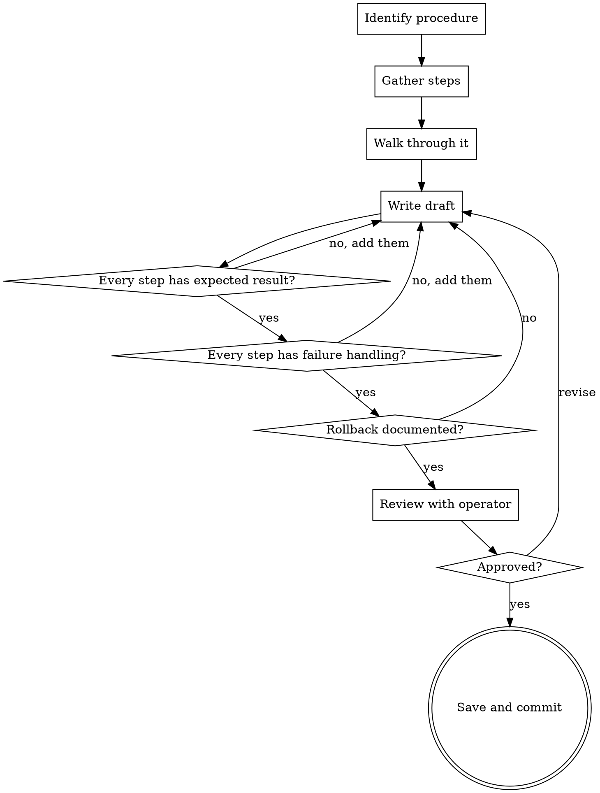

# Writing Standard Operating Procedures

## Overview

Write SOPs, runbooks, playbooks, and checklists for repeatable tasks. The output is a document an operator can follow under pressure—clear, sequential, and failure-aware.

**Core principle:** A good SOP works when the reader is stressed, tired, or unfamiliar with the system. Clarity and completeness save incidents.

**Announce at start:** "I'm using the writing-sops skill to create this procedure."

## When to Use

- Writing runbooks for incident response or operational tasks
- Creating playbooks for deployment, migration, or maintenance
- Documenting checklists for repeatable processes
- Building onboarding procedures or handoff documentation

**Not for:**

- User-facing how-to guides → use `writing-reference-docs`
- Architecture decisions → use `writing-design-specs`
- Project scoping → use `writing-scope-breakdowns`

## Document Structure

```markdown
# [Procedure Name]: SOP

**Last Verified:** YYYY-MM-DD
**Owner:** [name/team]
**Frequency:** On-demand | Daily | Weekly | Per-incident

## Purpose

One sentence. When and why you'd run this procedure.

## Prerequisites

- [ ] Access/permissions required
- [ ] Tools installed and versions
- [ ] Environment state required before starting
- [ ] Notifications sent (if applicable)

## Procedure

### Step 1: [Action]

What to do. Exact commands, UI paths, or actions.
**Expected result:** What you should see if it worked.
**If it fails:** What to do instead. Don't leave the operator guessing.

### Step 2: [Action]

...

## Verification

How to confirm the entire procedure succeeded.
Specific checks, queries, or tests to run.

## Rollback

How to undo this procedure if something goes wrong.
Step-by-step reversal, not just "revert the change."

## Troubleshooting

| Symptom | Likely Cause | Fix |
| ------- | ------------ | --- |

## Change Log

| Date | Author | Change |
| ---- | ------ | ------ |
```

## Process



## Checklist

1. **Identify the procedure** — what task, who performs it, how often
2. **Gather the steps** — interview operators, read existing docs, trace the actual process
3. **Walk through it yourself** — verify every command, check every output
4. **Write the draft** — follow the document structure above
5. **Verify codebase claims** — **REQUIRED SUB-SKILL:** Use superpowers:writing-doc-reviews to verify all commands, file paths, and expected outputs against actual code
6. **Verify completeness:**
   - Every step has an expected result
   - Every step has failure handling ("if this fails...")
   - Prerequisites are complete (nothing assumed)
   - Rollback steps are documented
   - Verification section confirms success
7. **Review with an operator** — someone who'll actually use it
8. **Save** — commit to `docs/sops/YYYY-MM-DD-<procedure>.md` or `docs/runbooks/`

## Writing Rules for SOPs

- **Imperative mood** — "Run the command" not "You should run the command"
- **One action per step** — don't combine multiple actions
- **Exact commands** — copy-pasteable, no placeholders without clear labels
- **Expected output** — show what success looks like after each step
- **Failure paths** — every step needs "if this fails" guidance
- **No assumptions** — state prerequisites, required access, environment state
- **Version-pin tools** — specify versions when behavior varies between them

## Common Mistakes

| Mistake                                        | Fix                                                |
| ---------------------------------------------- | -------------------------------------------------- |
| No failure handling                            | Add "If this fails:" after every step              |
| Assumed knowledge ("just restart the service") | Exact command: `systemctl restart <service-name>`  |
| No rollback plan                               | Document step-by-step reversal for every change    |
| Untested procedures                            | Walk through every step before publishing          |
| Missing prerequisites                          | List every tool, permission, and precondition      |
| Steps too large ("deploy the application")     | Break into atomic actions with verifiable outcomes |

## Key Principles

- **Stress-proof** — works when the reader is under pressure at 3am
- **Atomic steps** — one action, one verification, then move on
- **Failure-aware** — every step accounts for what can go wrong
- **Tested** — never publish a procedure you haven't walked through
- **Maintained** — SOPs rot fast; include "Last Verified" date and change log
